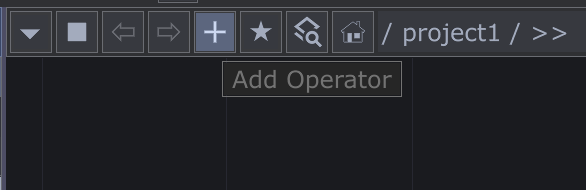
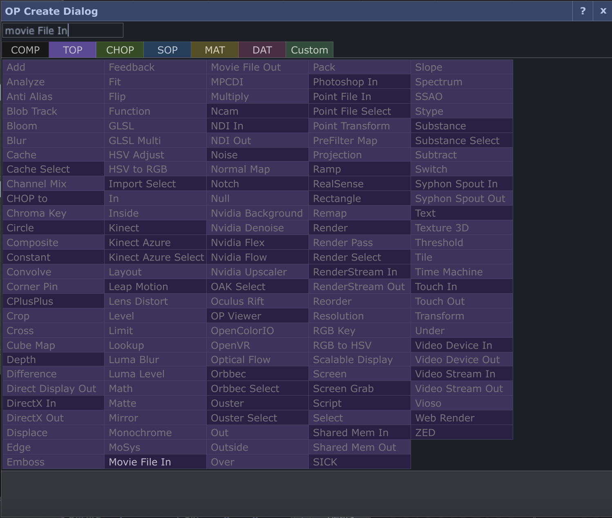
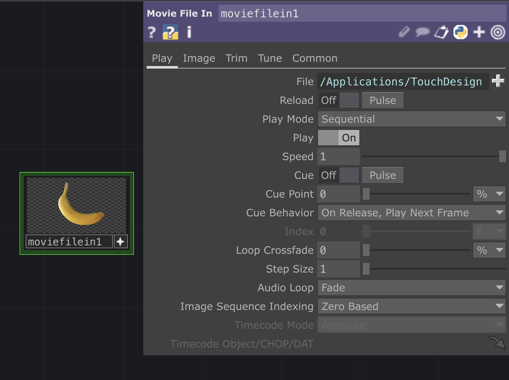
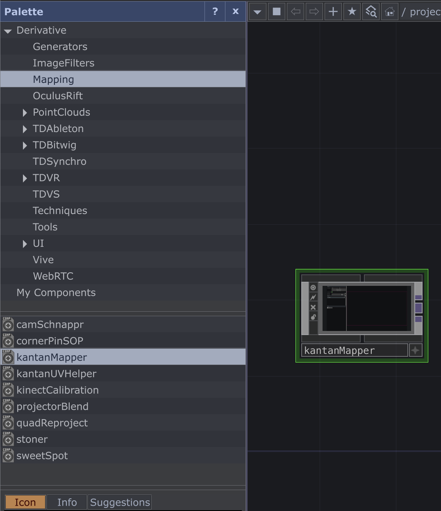
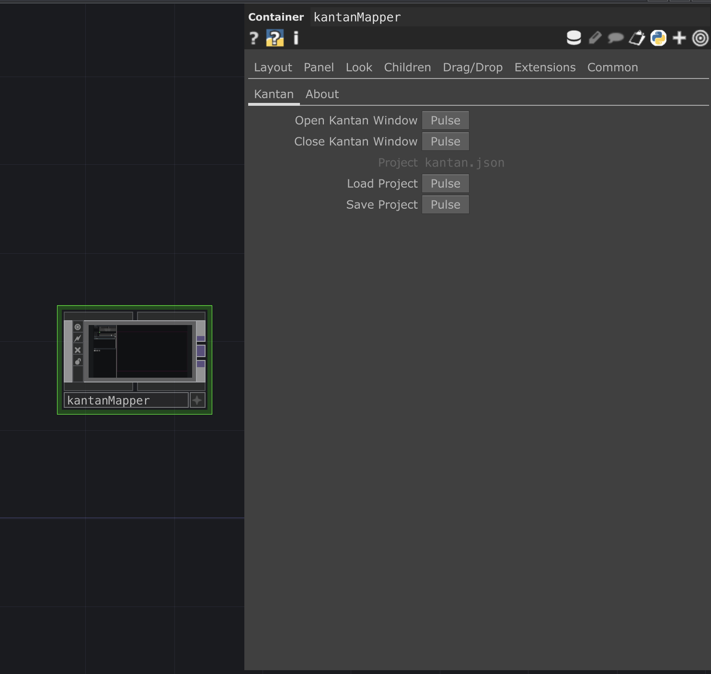
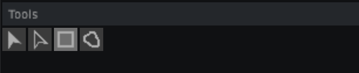
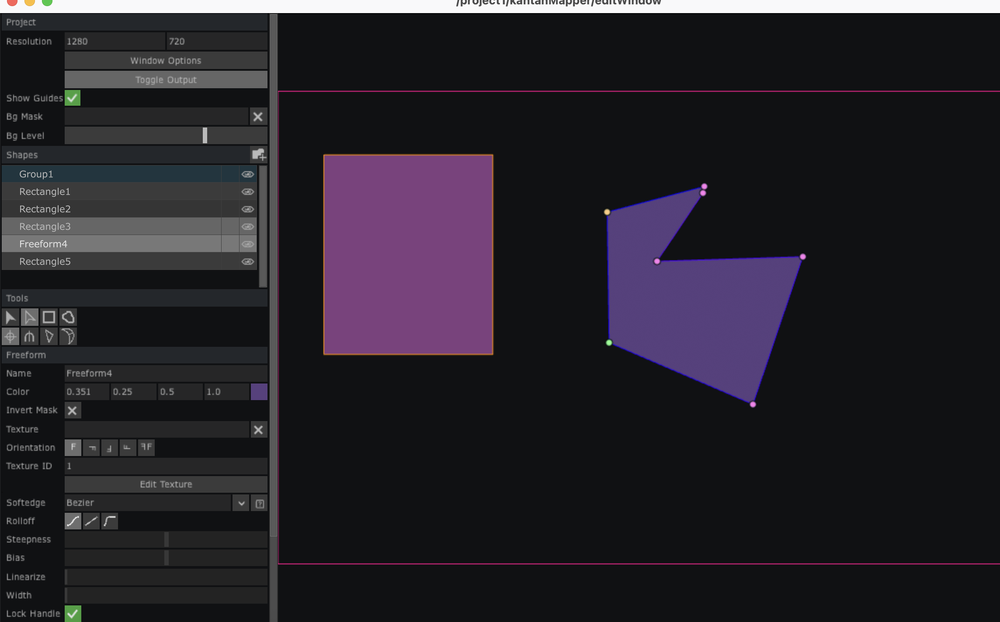
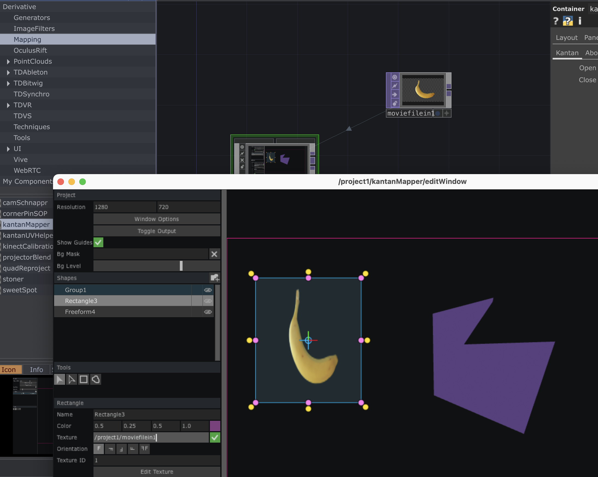

# Guide til Projektion Mapping

Projektion mapping er en teknik, der bruger software til at projicere billeder eller videoer på ujævne overflader, hvilket forvandler objekter til dynamiske visuelle displays. I DD Lab har vi en masse projektorer, som du kan bruge til dit projekt, hvis du har lyst til at arbejde med visuel kunst, VJ'ing, eller skal bruge en fed feature til et projekt!

**Eksempler:** [
The Coolest Examples of Projection Mapping (YouTube)](https://www.youtube.com/watch?v=PKMCB5v8pt0)

*Se denne video hvis du ikke forstår guiden under, den viser mange af trinene visuelt:*

**Video-guide:** [Projektion Mapping med TouchDesigner (YouTube)](https://www.youtube.com/watch?v=E1YMSPLVws0)

## 1. Software:
Vi anbefaler at bruge Touchdesigner, et profesionnelt program til visuel kunst man kan bruge til at lave visuel kunst live, og som også er god til projection mapping. Der er en gratis version som kan nærmest det samme som den professionelle, så det fungerer super godt!

1. Gå til [TouchDesigner Download-side](https://derivative.ca/download).
2. Klik på **Windows Download** eller **macOS Download**
3. Installer TouchDesigner på din computer.
4. Åben programmet, og opret en gratis konto

## 2. Importer video/billede
1. Dobbeltklik på baggrunden eller klik på "+" for at tilføje en ny 'operator'

2. I den Lila menu "TOP" vælg "Movie File In" (også selvom det er et billede du vil projektere)

3. Klik på Movie File In boxen (bananen) og vælg din videofil under "File"

## 3. Projektor
1. tilslut en projektor med hdmi
2. gå ind i din computers skærm indstillinger og sørg for at den ikke *mirror* din skærm men er en ekstern skærm. Og sørg for at din computer er 0, og din(e) projektor(er) er 1 (2,3,4, osv.)

## 4. Brug Kantan Mapper til projektion mapping

1. Ude til venstre i *Palette* vælg *mapping* og derefter -> **KantanMapper**

2. klik og træk den ind i arbejdsområdet
3. klik på kantan-mapper boksen
4. Klik på *Open Kantan Window* **Pulse**

5. klik på window options og indstil:
- Opening size: FILL
- Borders: OFF
- Always on top: ON
- I monitor slideren, sæt den til 0, 1 eller 2 alt efter hvor mange skærme du har, og hvordan dine skærme er opsat. Du kan åbne display indstillinger på din computer og se nogle ting, men nogle gange skal man prøve sig lidt frem med hvilke monitor der er hvilken projektor
- når du har indstillet klikker du på **Toggle Output** tilbage i kantan window menuen. Hvis alt er indstillet rigtigt projektoren blive sort og vise din mus som to et orange kryds mens du kører den rundt i Kantan kanvaset.

6. vælg enten quad eller freeform under tools for at tegne figurer på kanvassert, kig over på projektorens output for at få figuren til at passe med dit objekts omrids.

## 5. Få grafik på mappingen
1. klik og træk *movie file in* boksen over i den boks der hedder "texture" på den figur du gerne vil have bliver til billedet. (hvis du er i tvivl så se video guiden, link i toppen) 

2. Nu burde alt virke, hvis du vil tilføje flere projektorer skal du tilføje et nyt kantan mapper objekt.

